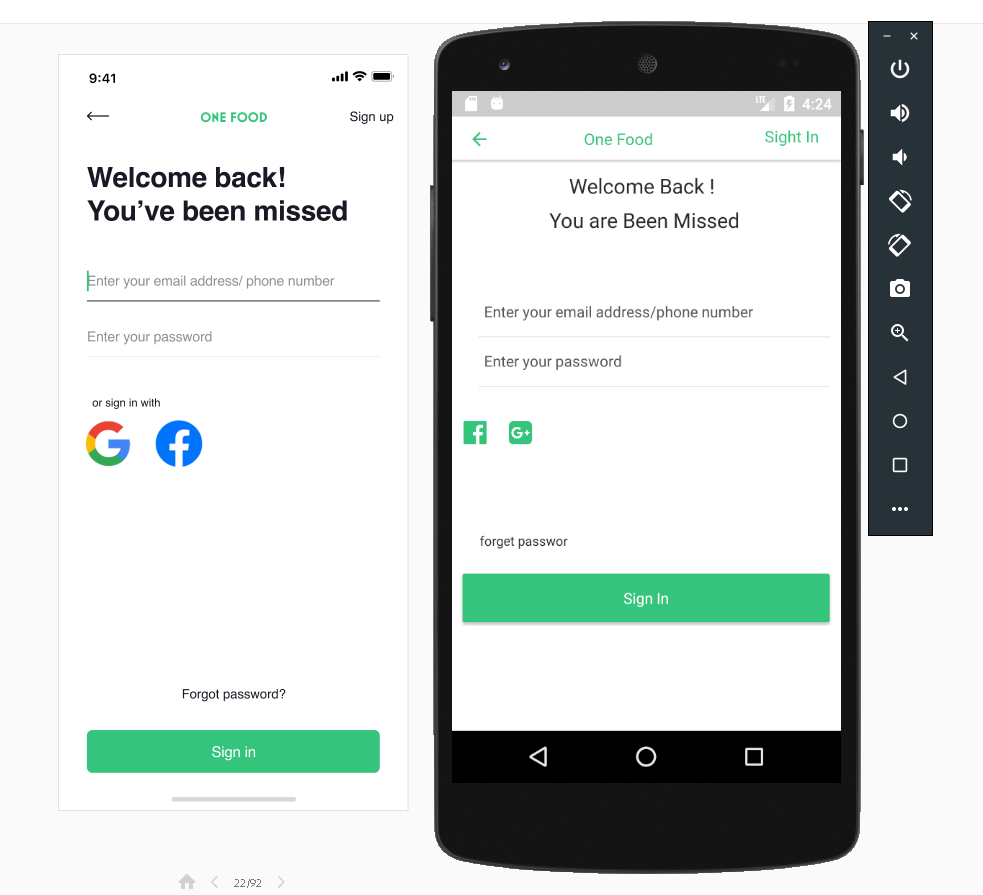

# Restaurant App

BoilerPlate Used React Native [https://github.com/kaushiknishchay/React-Native-Boilerplate](https://github.com/kaushiknishchay/React-Native-Boilerplate)

BoilerPlate Used React.JS [https://github.com/Codebrahma/Codebrahma-React-Boilerplate](https://github.com/Codebrahma/Codebrahma-React-Boilerplate)

## Setup

- Install and  setup the backend server
 
[https://github.com/Codebrahma/RestaurantApp-Express](https://github.com/Codebrahma/RestaurantApp-Express)

### Installation

- run `npm install` or `yarn install`

### Run on Device

- run `yarn android` or `yarn ios` to run on device or emulator

### Start the web version

- run `yarn start:web`

### Project info


Main objective of this project was to have a single code base for both 
web and mobile apps with the logic and view separated.

#### Project Structure    333757

```
    /android                - React native android source code
    
    /app                    - React native specific code
        /base_components    - reusable react native components
        /components         - react native components
        /screens            - connected to store components
        /App.js             - App Root component
        /router.js          - route config
        
    /assets                 - contains image and fonts
    /ios                    - React native ios source code
    
    /src
        /actions            - all redux actions
        /constants          - colors and Assets
        /reducers           - all reducers
        /sagas              - all redux sagas  
        /service            - API methods
        /store              - store config
        /utils              - some utility functions

    /web                    - react js web specific code
        /screens            - connected to store components
        /components         - react components
        /base_components    - reusable react components
        /App.js             - App Root component
        /routes.js          - route config
    /webpack                - webpack config
    
```

#### ScreenShots - Native App





### 运行
- 1.	 forward:  PC->Phone 作为Client客户端,可以任意访问Phone上的 Server 服务器  
         adb forward tcp:8888 tcp:8888
         reverse:反向代理  Phone->PC  
         adb reverse tcp:8097 tcp:8097  
         adb reverse tcp:8081 tcp:8081
         8081端口的服务就是React Native项目的一个本地服务器
         用于提供JSBundle包和一些静态资源

- 2.	npm install -g react-devtools      npm install -g   react-native
        配置:”scripts”:{“react-devtools”:” react-devtools”}
        npm  run react-devtools

- 3.	android avd  命令无效，可以重启，使得环境变量彻底生效
        adb devices

- 4.    React-native bundle --platform Android --dev false --entry-file index.js --bundle-output android/app/src/main/assets/index.android.bundle --assets-dest android/app/src/main/res

- 5.	打开模拟器
        D: 
        cd D:\sdk\tools\          
        emulator.exe -netdelay  none  -netspeed full -avd api23  -partition-size 2048   
        emulator.exe -netdelay  none  -netspeed full -avd API2301   
        打开模拟机dev       adb shell input keyevent 82              
        C:\Users\liuniuyou\.android\avd\API2301.avd  
        模拟器上想要访问PC本地的localhost的话，要用10.0.2.2,有一些可能是10.0.0.2，  
        模拟器会映射到PC本地的localhost  

- 6. import CustomVariables from './native-base-theme/variables'  
     import getTheme from  './native-base-theme/components'  
     import { Container, Content, Text, StyleProvider } from 'native-base';  
     <StyleProvider style={getTheme(material)}>     
     <StyleProvider style={getTheme(CustomVariables)}>  
     </StyleProvider>  
     import {StyleSheet, TouchableOpacity, View} from 'react-native'  
     transparent
  
- 7. 图标库:http://fontawesome.dashgame.com/     
     https://fontawesome.com/icons?d=gallery&c=buildings    
     https://rn.mobile.ant.design/components/icon-cn/          
 
- 8. 调试分支 新建远程零时分支 git checkout -b tmp    
     把新建的本地分支push到远程服务器，远程分支与本地分支同名（当然可以随意起名）：   
     git push origin tmp:tmp    
     合并分支  git merge   
     删除指定的远程分支  git push origin --delete tmp  
     删除指定的本地分支  git branch -d  tmp

- 9.  npm get registry
      https://registry.npmjs.org/
        
      yarn config set registry  https://registry.npmjs.org/
      npm config set registry http://registry.npmjs.org/
      npm config set registry http://registry.npm.taobao.org/
    
- 10. cnpm install node-sass -g
      查看所有版本  npm view(info) npm versions
      npm info expo@30.0.0
      npm info  npm 
      npm  ls  expo -g
      
      
- 11.  npm --version   6.5.0    
       node --version  v10.16.2
   
       npm install --save-dev webpack-cli@3.3.6 &&
       npm install --save-dev jest@24.8.0 && 
       npm install --save-dev css-loader@3.2.0 && 
       npm install --save-dev optimize-css-assets-webpack-plugin@5.0.3 && 
       npm install --save-dev webpack-bundle-analyzer@3.4.1 &&
       
       npm install react-native@0.60.4
       
       <Scene
           key="welcomeScreen"
           component={WelcomeScreen}
       />
       
       <Scene
               key="Reward"
               component={RewardScreen}
               title="Reward"
               icon={RewardIcon}
       />
       
       
       


